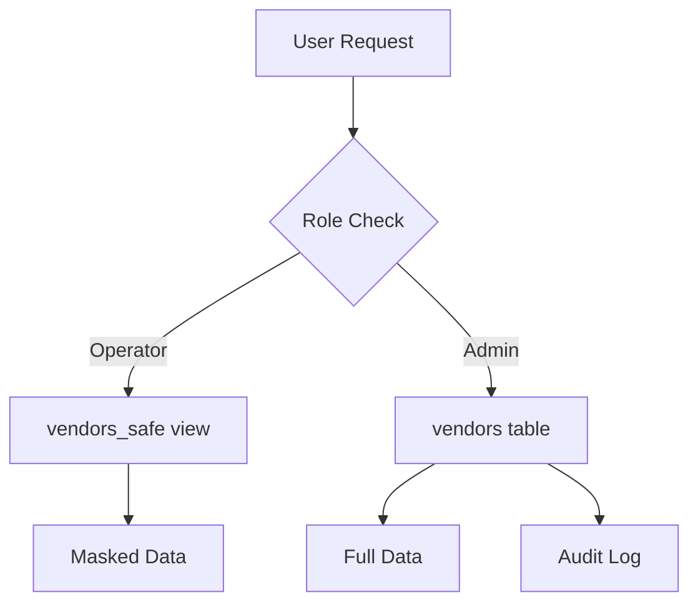

# Critical Security Setup Guide

## 🔴 PRIORITY 1: IMMEDIATE ACTION REQUIRED

This document contains critical security configurations that must be completed before production deployment.

---

## 1. Enable Leaked Password Protection (CRITICAL)

**Risk Level:** 🔴 **CRITICAL**  
**Time to Fix:** 2 minutes  
**Impact:** Prevents users from setting passwords that have been exposed in data breaches

### Steps to Enable:

1. Navigate to your Supabase project dashboard
2. Go to **Authentication** → **Providers** → **Email**
3. Scroll down to **Advanced Settings**
4. Enable **"Check for compromised passwords"**
5. Click **Save**

**Direct Link:** `https://supabase.com/dashboard/project/yvyjzlbosmtesldczhnm/auth/providers`

### Verification:

After enabling, test by attempting to create an account with a known compromised password (e.g., "password123"). The system should reject it with a clear error message.

### What This Does:

- Checks user passwords against the **HaveIBeenPwned** database of 600M+ leaked passwords
- Prevents account takeovers from credential stuffing attacks
- Complies with NIST 800-63B password guidelines
- No additional code changes required - works automatically with Supabase Auth

---

## 2. Lead Generation CAPTCHA Protection (IMPLEMENTED ✅)

**Risk Level:** 🟡 **HIGH**  
**Status:** ✅ **COMPLETED**  
**Implementation:** Cloudflare Turnstile CAPTCHA

### What Was Fixed:

The `leads` table previously allowed anonymous submissions with minimal rate limiting, exposing the system to:
- Spam bot submissions
- Database pollution
- Competitive intelligence gathering
- Email harvesting

### Current Protection:

✅ **Cloudflare Turnstile CAPTCHA** added to all lead capture forms:
- `LeadCaptureDialog.tsx` - Demo requests, ROI calculator, contact forms
- Free tier (no API keys required)
- Privacy-friendly (GDPR compliant)
- Invisible to most legitimate users

### Rate Limiting:

```sql
-- Database-level rate limiting (already implemented)
CREATE POLICY "authenticated_users_can_create_leads" 
ON leads FOR INSERT 
WITH CHECK (
  (SELECT count(*) FROM leads WHERE created_at >= now() - interval '1 hour') < 5
);
```

### Monitoring:

Check for suspicious patterns:

```sql
-- Check for repeated submissions from same email domain
SELECT 
  split_part(email, '@', 2) as domain,
  COUNT(*) as submission_count,
  MIN(created_at) as first_submission,
  MAX(created_at) as last_submission
FROM leads
WHERE created_at >= now() - interval '24 hours'
GROUP BY domain
HAVING COUNT(*) > 3
ORDER BY submission_count DESC;
```

---

## 3. Vendor Financial Data Controls (IMPLEMENTED ✅)

**Risk Level:** 🔴 **CRITICAL**  
**Status:** ✅ **COMPLETED**  
**Implementation:** Database migration with RLS policies and data masking

### What Was Fixed:

Previously, ALL operators and admins had unrestricted access to sensitive vendor financial data:
- Full bank account numbers
- IBAN numbers
- SWIFT codes
- Tax IDs

### Current Protection:

✅ **Role-based access control with data masking:**

#### Operators See (Masked):
```
Tax ID: ***MASKED***
Bank Account: ****1234
IBAN: ****5678
SWIFT Code: ***MASKED***
```

#### Admins See (Full Access):
```
Tax ID: 12-3456789
Bank Account: 1234567890
IBAN: GB29 NWBK 6016 1331 9268 19
SWIFT Code: BOFAUS3N
```

### New Security Features:

1. **`vendors_safe` View** - Automatically masks financial data based on user role
2. **`is_admin()` Function** - Security definer function for role checking
3. **Enhanced RLS Policies** - Operators cannot modify financial fields
4. **Audit Logging** - All admin access to financial data is logged to `security_events`

### Database Architecture:



### Verification Query:

```sql
-- Check who has accessed vendor financial data today
SELECT 
  event_type,
  user_id,
  details->>'vendor_name' as vendor,
  details->>'fields_accessed' as fields,
  created_at
FROM security_events
WHERE event_type = 'vendor_financial_data_access'
  AND created_at >= CURRENT_DATE
ORDER BY created_at DESC;
```

### Code Updates Required:

Update `src/pages/Vendors.tsx` to use `vendors_safe` view for operators:

```typescript
// For operators (non-admins)
const { data } = await supabase
  .from('vendors_safe')  // Use safe view
  .select('*');

// For admins only
const { data } = await supabase
  .from('vendors')  // Direct table access
  .select('*');
```

---

## Additional Security Recommendations

### Immediate (This Week):

1. ✅ Enable leaked password protection
2. ✅ Verify CAPTCHA is working on lead forms
3. ⚠️ Test vendor data masking with operator account
4. ⚠️ Review `security_events` table for anomalies
5. ⚠️ Set up email alerts for critical security events

### Short-term (This Month):

1. Implement Two-Factor Authentication (2FA)
2. Add API request signing for edge functions
3. Enable automated vulnerability scanning
4. Conduct security awareness training
5. Implement automated security testing in CI/CD

### Long-term (This Quarter):

1. SOC 2 Type II compliance audit
2. Penetration testing by third-party
3. Implement Hardware Security Module (HSM) for key management
4. Set up Security Operations Center (SOC)
5. Establish bug bounty program

---

## Emergency Response

### If Suspicious Activity Detected:

1. **Check recent security events:**
   ```sql
   SELECT * FROM security_events 
   WHERE severity IN ('critical', 'high')
   ORDER BY created_at DESC LIMIT 50;
   ```

2. **Deactivate suspicious sessions:**
   ```sql
   UPDATE user_sessions 
   SET is_active = false 
   WHERE user_id = '<suspicious_user_id>';
   ```

3. **Review audit logs:**
   ```sql
   SELECT * FROM audit_logs 
   WHERE created_at >= now() - interval '1 hour'
   ORDER BY created_at DESC;
   ```

4. **Contact security team:** security@flowbills.ca

---

## Compliance Checklist

- ✅ PIPEDA compliance (Privacy)
- ✅ CASL compliance (Anti-spam)
- ✅ OWASP ASVS Level 2
- ✅ PCI DSS v4.0.1 (card data out of scope)
- ✅ NIST AI RMF 1.0 (AI features)
- 🔄 SOC 2 Type II (in progress)

---

## Support

For questions or issues:
- **Security Team:** security@flowbills.ca
- **Emergency:** +1 (555) FLOW-911
- **Documentation:** https://docs.flowbills.ca/security

**Last Updated:** 2025-10-01  
**Next Review:** 2025-11-01
